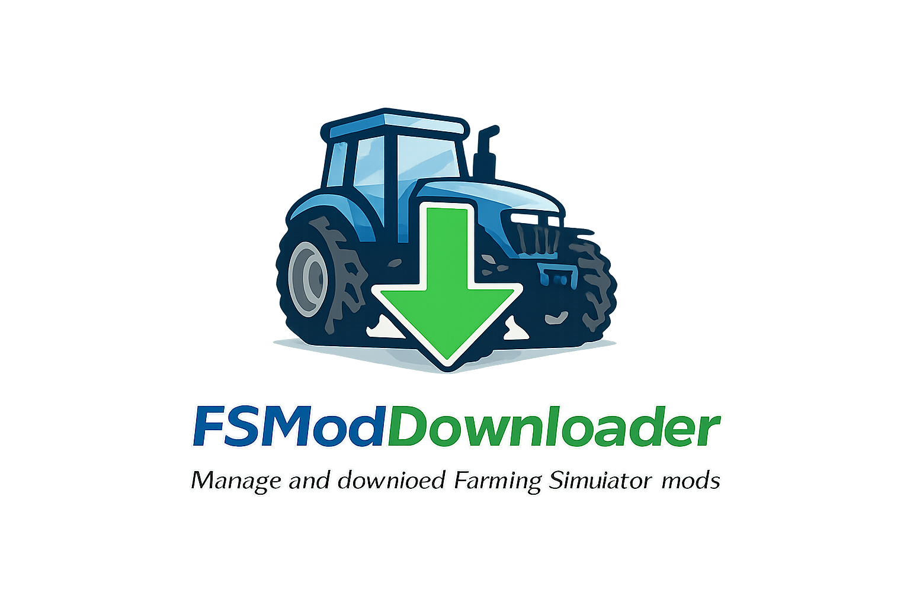

# FS Mod Downloader

A desktop application for managing and downloading Farming Simulator mods, similar to CKAN for Kerbal Space Program.

## 📥 Download

**[Download Latest Release](https://github.com/TmoneyMKII/FS-Mod-Downloader/releases/latest)**

Download the latest `.zip` file from the Releases page, extract it, and run `FSModDownloader.exe`.

### System Requirements

- Windows 10/11 (64-bit)
- .NET 8.0 Runtime (will prompt to install if not present)
- Internet connection for mod browsing and downloads

---

## 🚀 Getting Started

### First Time Setup

1. **Download and Extract**
   - Download the latest release `.zip` file
   - Extract to any folder (e.g., `C:\Games\FSModDownloader`)
   - Run `FSModDownloader.exe`

2. **Configure Game Instances**
   - Click the **⚙️ Settings** button in the top-right corner
   - Click **🔍 Scan for Games** to automatically detect your Farming Simulator installations
   - The app will find FS15, FS17, FS19, FS22, and FS25 installations
   - Click **Save Settings** to confirm

3. **Manual Game Setup** (if auto-detect doesn't find your game)
   - In Settings, click **➕ Add Manual Entry**
   - Select your game version from the dropdown
   - Browse to your mods folder (usually `Documents\My Games\FarmingSimulatorXXXX\mods`)
   - Click **Add**

### Using the App

1. **Select Your Game**
   - Use the dropdown in the left sidebar to choose which game to manage mods for

2. **Browse Mods**
   - Mods are displayed in the main area with images, names, and descriptions
   - Use the **Search** bar to find specific mods
   - Use **Categories** in the sidebar to filter by type (Tractors, Maps, Equipment, etc.)

3. **Install Mods**
   - Click the **Install** button on any mod card
   - The mod will be downloaded and installed to your selected game's mods folder
   - Check the **INSTALLED MODS** section in the sidebar to see your installed mods

4. **View Mod Details**
   - Click **Details** on any mod to see more information

---

## ✨ Features

- **Mod Discovery**: Browse and search for mods from mod-network.com
- **One-Click Installation**: Easy mod installation directly to your game
- **Multiple Game Support**: Supports FS15, FS17, FS19, FS22, and FS25
- **Auto-Detection**: Automatically finds your Farming Simulator installations
- **Mod Categories**: Filter by Vehicles, Tractors, Maps, Equipment, and more
- **Clean Dark UI**: Modern, easy-to-use interface

---

## ❓ Troubleshooting

### "No game instances configured"
Open Settings and click "Scan for Games", or manually add your game's mods folder.

### Mods not showing in game
- Make sure you selected the correct game instance
- Verify the mods folder path in Settings matches your game's actual mods folder
- Restart Farming Simulator after installing mods

### App won't start
- Make sure you have .NET 8.0 Runtime installed
- Try running as Administrator
- Check Windows Defender hasn't quarantined the app

---

## 👨‍💻 For Developers

See the [Developer README](FSModDownloader/README.md) for technical documentation, build instructions, and contribution guidelines.

---

## 👤 Author

**SWR Entertainment**  
Created by Tyler Bradham

- GitHub: [@TmoneyMKII](https://github.com/TmoneyMKII)
- Discord: tmoneymkii

## 📄 License

This project is licensed under the MIT License.
